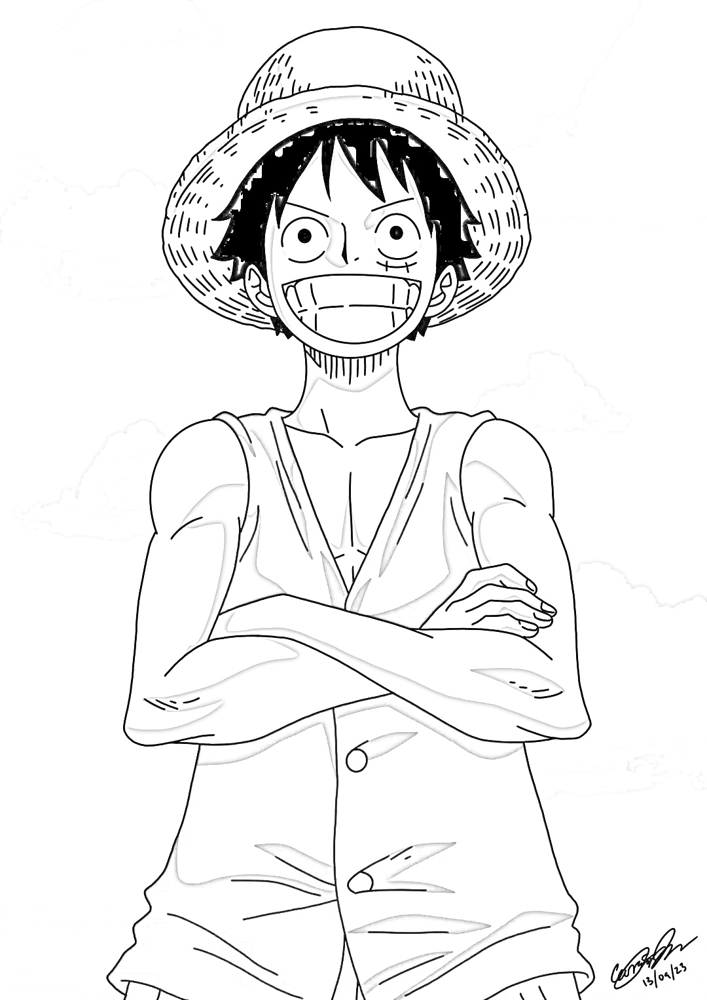

# 🖼️ Image to Pencil Sketch | OpenCV Project

_Transform any image into a realistic pencil sketch using Python and OpenCV._

---

## 🧭 Table of Contents
- <a href="#overview">📘 Overview</a>
- <a href="#problem-statement">❓ Problem Statement</a>
- <a href="#dataset">🧠 Dataset</a>
- <a href="#tools--technologies">🧰 Tools & Technologies</a>
- <a href="#methods">⚙️ Methods</a>
- <a href="#key-insights">💡 Key Insights</a>
- <a href="#output--results">🖼️ Output / Results</a>
- <a href="#how-to-run-this-project">▶️ How to Run this Project</a>
- <a href="#results--conclusion">🏁 Results & Conclusion</a>
- <a href="#author--contact">👤 Author & Contact</a>

---

<h2><a class="anchor" id="overview"></a>📘 Overview</h2>

This project demonstrates how simple image processing techniques can transform a photo into a **hand-drawn pencil sketch**. By applying grayscale conversion, image inversion, Gaussian blur, and pixel-wise division, we replicate a natural sketch shading effect.

It’s an ideal beginner project to learn **OpenCV** and **Computer Vision Fundamentals**.

---

<h2><a class="anchor" id="problem-statement"></a>❓ Problem Statement</h2>

Create a Python program that takes an image as input and outputs a **pencil sketch version** of it using OpenCV’s image processing functions.

Goals:
- Understand pixel-based transformations  
- Learn how filters and mathematical operations affect image tone  
- Generate an artistic sketch-style result

---

<h2><a class="anchor" id="dataset"></a">🧠 Dataset</h2>

There’s no fixed dataset for this project. You can use **any image file** (e.g., `.jpg`, `.png`, `.webp`) — portraits, landscapes, or any picture of your choice.

Example:
```
Input:  Lofi.webp
Output: pencil_sketch.jpg
```

---

<h2><a class="anchor" id="tools--technologies"></a>🧰 Tools & Technologies</h2>

| Tool / Library | Purpose |
|----------------|---------|
| **Python 3.x**  | Programming language |
| **OpenCV (cv2)**| Image processing library |
| **VS Code / PyCharm** | Code editor |
| **Git & GitHub** | Version control and hosting |

Install required module:
```bash
pip install opencv-python
```

---

<h2><a class="anchor" id="methods"></a>⚙️ Methods</h2>

1. **Read the Image** → `cv2.imread()`  
2. **Convert to Grayscale** → `cv2.cvtColor(image, cv2.COLOR_BGR2GRAY)`  
3. **Invert the Grayscale Image** → `cv2.bitwise_not()`  
4. **Apply Gaussian Blur** → `cv2.GaussianBlur()`  
5. **Invert the Blurred Image**  
6. **Create the Sketch Effect** using `cv2.divide()`  
7. **Display and Save Output**

Full code is in `pencil_sketch.py`.

---

<h2><a class="anchor" id="key-insights"></a>💡 Key Insights</h2>

- Grayscale + inversion simulate pencil tone differences.  
- Gaussian Blur provides smooth shading similar to sketch strokes.  
- Image division enhances edge detail naturally.  
- OpenCV’s basic functions can create artistic transformations with simple math.

---

<h2><a class="anchor" id="output--results"></a>🖼️ Output / Results</h2>

**🖼️ Input Image:**  


**✏️ Generated Pencil Sketch:**  



**🎥 Live Demo:**  

Check out the live working demo of this project on my **LinkedIn** post below 👇  
🔗 [Watch Live on LinkedIn](https://www.linkedin.com/in/your-linkedin-username/)


---

<h2><a class="anchor" id="how-to-run-this-project"></a>▶️ How to Run this Project</h2>

1. **Clone the repository**
   ```bash
   git clone https://github.com/HarshHarachkar/pencil-sketch-opencv-python.git
   cd pencil-sketch-opencv-python
   ```

2. **Install dependencies**
   ```bash
   pip install opencv-python
   ```

3. **Run the script**
   ```bash
   python pencil_sketch.py
   ```

4. The output file `pencil_sketch.jpg` will be saved in your project folder.

---

<h2><a class="anchor" id="results--conclusion"></a>🏁 Results & Conclusion</h2>

✅ Converted photos into **pencil sketches** using simple OpenCV operations.  
✅ Gained practical understanding of grayscale conversion, image inversion, blurring, and pixel-wise arithmetic.  

**Future improvements**
- Add a **Streamlit/Tkinter GUI** for easy uploads.  
- Create a small web app so others can try the tool online.

---

<h2><a class="anchor" id="author--contact"></a>👤 Author & Contact</h2>

**Author:** Harsh Harachkar <br>
**Email:** harshharachkar666@gmail.com <br>
**GitHub:** [https://github.com/HarshHarachkar](https://github.com/HarshHarachkar)  
**LinkedIn:** [https://www.linkedin.com/in/harshh110406](https://www.linkedin.com/in/yourprofile)  
